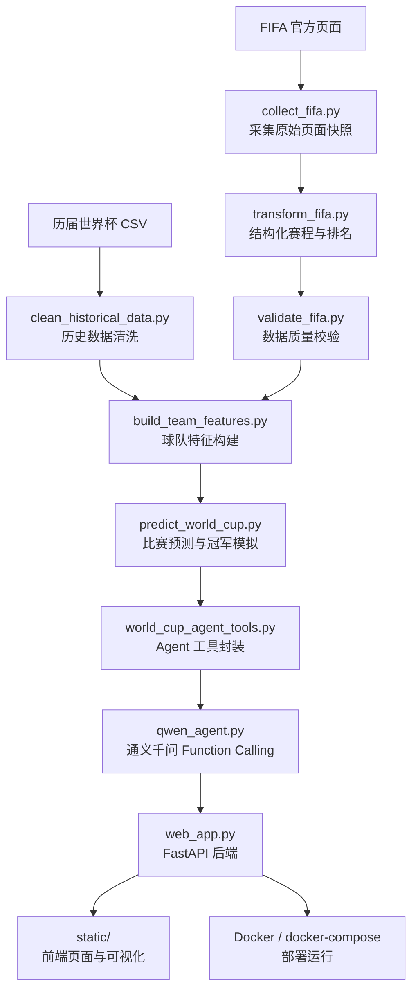
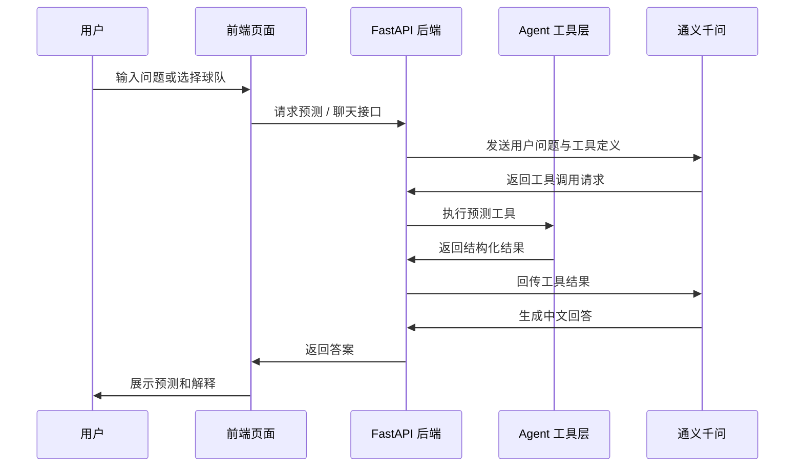

# World Cup Prediction Agent

一个面向世界杯赛程、球队实力分析、比赛预测与自然语言问答的 Agent 项目。

本项目从公开数据采集开始，经过数据清洗、球队特征构建、比赛预测建模、Agent 工具封装，最终提供一个可本地运行、可 Docker 部署、可接入阿里云百炼 / DashScope / 通义千问模型的 Web 应用。

> 重要提醒：本项目是教学与实验性质的预测系统，预测结果不是确定事实，也不构成博彩、投资或任何现实决策建议。

## 1. 项目目标

本项目希望完成一个“能解释、能预测、能对话”的足球世界杯 Agent：

- 自动采集 FIFA 官方赛程、比分和男足世界排名数据。
- 清洗历届世界杯对战数据和冠军数据。
- 构建球队特征，包括 FIFA 排名、FIFA 积分、历史 Elo、进攻能力、防守失球能力、当前赛事状态等。
- 使用概率模型预测单场比赛结果和晋级概率。
- 使用 Monte Carlo 模拟预测冠军概率。
- 将预测能力封装成 Agent 工具函数。
- 接入阿里云旗下大模型，让用户可以用中文自然语言提问。
- 提供 Web 页面进行可视化展示和交互。
- 支持 Docker 部署，后续可迁移到云服务器、容器平台或其他托管平台。

## 2. 系统架构设计

整体架构分为五层：数据层、特征层、模型层、Agent 工具层、应用展示层。



### 2.1 数据层

数据层负责把分散的数据整理成稳定、可复现的本地文件。

主要脚本：

- `collect_fifa.py`：采集 FIFA 官方页面，保存 HTML、页面文本、DOM 解析记录和元数据。
- `transform_fifa.py`：将原始页面快照转换为结构化 CSV。
- `validate_fifa.py`：校验排名数据、赛程数据、淘汰赛编号、比分字段等是否合理。
- `clean_historical_data.py`：清洗历届世界杯比赛和冠军数据，统一球队名称。

输出目录：

```text
data/
├─ raw/
│  └─ fifa/
│     └─ <snapshot_id>/
├─ processed/
│  ├─ fifa/
│  │  └─ <snapshot_id>/
│  │     ├─ matches.csv
│  │     ├─ rankings.csv
│  │     └─ processed_manifest.json
│  └─ history/
│     ├─ historical_matches_clean.csv
│     ├─ tournament_results_clean.csv
│     ├─ team_name_mapping.csv
│     └─ cleaning_report.json
```

### 2.2 特征层

特征层将原始数据转换成模型可用的球队特征。

主要脚本：

- `build_team_features.py`

核心特征包括：

| 特征 | 含义 |
| --- | --- |
| `fifa_rank` | FIFA 当前排名 |
| `fifa_points` | FIFA 当前积分 |
| `elo_rating` | 根据历届世界杯比赛构建的时间顺序 Elo |
| `attack_index` | 平滑后的进攻能力指标 |
| `defense_conceding_index` | 平滑后的防守失球指标，越低越好 |
| `strength_index` | 综合实力指标 |
| `current_ppg` | 当前赛事阶段场均积分 |
| `world_cup_titles` | 历史世界杯冠军次数 |
| `historical_matches` | 历史世界杯参赛比赛数量 |

输出目录：

```text
data/model/<snapshot_id>/
├─ team_features.csv
└─ feature_metadata.json
```

### 2.3 模型层

模型层负责把球队特征转化为比赛预测和赛事预测。

主要脚本：

- `predict_world_cup.py`

当前模型设计：

1. 使用球队综合实力、进攻能力和防守能力估计双方期望进球。
2. 使用独立 Poisson 分布估计常规时间比分概率。
3. 对淘汰赛使用晋级概率处理平局后的加时 / 点球不确定性。
4. 对淘汰赛阶段进行 Monte Carlo 模拟，估计进入半决赛、决赛和夺冠概率。

输出目录：

```text
data/predictions/<snapshot_id>/
├─ match_predictions.csv
├─ tournament_probabilities.csv
├─ bracket_prediction.json
└─ prediction_report.json
```

### 2.4 Agent 工具层

Agent 工具层是项目的核心中间层，它把预测系统包装成大模型可以调用的函数。

主要文件：

- `world_cup_agent_tools.py`

已封装工具：

| 工具函数 | 作用 |
| --- | --- |
| `get_schedule` | 查询已完成或未进行比赛 |
| `get_team_profile` | 查询球队画像 |
| `predict_match` | 预测两队比赛结果 |
| `explain_prediction` | 解释比赛预测依据 |
| `get_champion_probabilities` | 查询冠军概率榜 |
| `get_bracket_prediction` | 查询完整淘汰赛路径预测 |
| `simulate_tournament` | 重新运行 Monte Carlo 模拟 |

这层的好处是：模型本身不直接读 CSV，也不凭空编造数据，而是通过工具调用获得结构化结果。

### 2.5 大模型与应用层

主要文件：

- `agent_config.py`：读取模型配置和环境变量。
- `agent_settings.json`：保存非敏感配置，例如模型名、base URL、超时时间。
- `qwen_agent.py`：使用 OpenAI-compatible API 接入阿里云 DashScope / 通义千问。
- `web_app.py`：FastAPI 后端，提供页面和 API。
- `static/`：前端页面、样式和交互逻辑。

模型配置示例：

```json
{
  "base_url": "https://dashscope.aliyuncs.com/compatible-mode/v1",
  "model": "qwen3.6-plus",
  "enable_thinking": false,
  "max_tool_rounds": 8,
  "timeout_seconds": 120
}
```

API Key 不写入代码，也不写入 `agent_settings.json`。本地测试时放在 `.env`：

```env
DASHSCOPE_API_KEY=your_new_dashscope_api_key
```

## 3. 全流程开发步骤

如果从零开始复现项目，可以按照下面顺序执行。

### 3.1 安装依赖

建议使用 Python 3.10+。

```powershell
python -m pip install -r requirements.txt
python -m pip install -r requirements-web.txt
python -m playwright install chromium
```

### 3.2 采集 FIFA 数据

```powershell
python collect_fifa.py
```

采集结果会写入：

```text
data/raw/fifa/<snapshot_id>/
```

如果 Playwright 浏览器未安装，执行：

```powershell
python -m playwright install chromium
```

### 3.3 转换 FIFA 数据

```powershell
python transform_fifa.py
```

脚本会自动选择最新的原始快照，输出：

```text
data/processed/fifa/<snapshot_id>/
```

### 3.4 校验 FIFA 数据

```powershell
python validate_fifa.py
```

校验目标：

- 排名数据至少覆盖参赛球队。
- 世界杯比赛数量合理。
- 已完成比赛有比分。
- 未进行比赛不伪造比分。
- 淘汰赛编号和上下游关系合理。

### 3.5 清洗历史世界杯数据

如果你有历届世界杯数据，例如：

```text
wcmatches.csv
worldcups.csv
```

运行：

```powershell
python clean_historical_data.py
```

输出：

```text
data/processed/history/
```

### 3.6 构建球队特征

```powershell
python build_team_features.py
```

输出：

```text
data/model/<snapshot_id>/
```

### 3.7 运行预测模型

```powershell
python predict_world_cup.py
```

输出：

```text
data/predictions/<snapshot_id>/
```

### 3.8 测试 Agent 工具

```powershell
python world_cup_agent_tools.py
```

如果正常，会输出当前快照、球队数量、比赛数量和冠军概率。

### 3.9 测试命令行 Agent

先配置 `.env`：

```env
DASHSCOPE_API_KEY=your_new_dashscope_api_key
```

然后运行：

```powershell
python qwen_agent.py --check
python qwen_agent.py
```

### 3.10 启动 Web 应用

```powershell
python web_app.py
```

浏览器打开：

```text
http://127.0.0.1:8000
```

## 4. Web 可视化呈现

前端页面位于：

```text
static/
├─ index.html
├─ styles.css
└─ app.js
```

当前页面包含：

- 健康状态展示。
- 冠军概率排行。
- 淘汰赛路径展示。
- 双方对战预测。
- 自然语言聊天窗口。

前端调用后端 API：

| API | 方法 | 说明 |
| --- | --- | --- |
| `/api/health` | GET | 系统健康状态 |
| `/api/teams` | GET | 球队列表 |
| `/api/probabilities` | GET | 冠军概率榜 |
| `/api/bracket` | GET | 淘汰赛路径预测 |
| `/api/predict-match` | POST | 单场比赛预测 |
| `/api/chat` | POST | Agent 对话 |

应用交互流程：



## 5. 创新与创意

### 5.1 从“静态预测”升级为“可对话预测”

传统比赛预测通常只输出一个概率表。本项目把预测能力封装成 Agent 工具，使用户可以直接问：

- “法国和巴西谁更可能晋级？”
- “阿根廷夺冠概率是多少？”
- “帮我解释一下英格兰为什么被模型看好。”
- “列出还没进行的淘汰赛。”

Agent 不只是回答结果，还会调用工具、读取数据、组织解释。

### 5.2 数据可追溯

采集阶段保存了 HTML、页面文本、DOM 记录和 manifest。这样后续如果预测结果异常，可以回溯到原始页面快照，而不是只看到最终 CSV。

### 5.3 模型结果可解释

单场预测不只输出胜负，还包含：

- 期望进球。
- 90 分钟胜平负概率。
- 晋级概率。
- 最可能比分。
- 关键解释依据。

这比单纯输出“某队胜率 60%”更适合 Agent 场景。

### 5.4 工具层与模型层解耦

`world_cup_agent_tools.py` 不绑定某一个大模型厂商。理论上只要模型支持 Function Calling，就可以接入：

- 阿里云通义千问。
- OpenAI-compatible 模型。
- 其他兼容工具调用的大模型。

当前实现优先适配阿里云 DashScope，因为后续部署目标偏向阿里云生态。

### 5.5 本地运行与云部署兼容

项目既可以在 PyCharm 中直接运行，也可以通过 Docker 部署。

本地开发：

```powershell
python web_app.py
```

容器部署：

```bash
docker compose up -d --build
```

## 6. 项目目录说明

```text
.
├─ collect_fifa.py                 # FIFA 原始页面采集
├─ transform_fifa.py               # 原始快照转 CSV
├─ validate_fifa.py                # 数据校验
├─ clean_historical_data.py        # 历史世界杯数据清洗
├─ build_team_features.py          # 球队特征构建
├─ predict_world_cup.py            # 比赛预测与冠军模拟
├─ world_cup_agent_tools.py        # Agent 工具函数
├─ agent_config.py                 # 配置读取
├─ agent_settings.json             # 非敏感模型配置
├─ qwen_agent.py                   # 通义千问 Agent
├─ web_app.py                      # FastAPI Web 应用
├─ static/                         # 前端页面
├─ data/                           # 数据与模型输出
├─ Dockerfile                      # Docker 镜像构建
├─ docker-compose.yml              # Docker Compose 编排
├─ nginx.conf                      # Nginx 反向代理配置
├─ requirements.txt                # 数据采集与处理依赖
├─ requirements-web.txt            # Web 与 Agent 服务依赖
├─ .env.example                    # 环境变量示例
├─ .dockerignore                   # Docker 构建忽略文件
├─ .gitignore                      # Git 忽略文件
└─ README.md                       # 项目说明
```

## 7. GitHub 上传注意事项

不要上传真实密钥。

`.gitignore` 至少应包含：

```gitignore
.env
__pycache__/
*.pyc
.venv/
venv/
env/
.idea/
data/raw/
*.log
```

可以上传：

- 源代码。
- 清洗后的示例数据。
- 模型输出结果。
- 前端页面。
- Docker 配置。

不建议上传：

- `.env`
- API Key
- PyCharm `.idea/`
- Python 缓存
- 原始网页快照 `data/raw/`
- 个人本地虚拟环境

## 8. Docker 部署

本地或服务器上运行：

```bash
docker compose up -d --build
```

查看状态：

```bash
docker compose ps
docker compose logs -f app
```

访问：

```text
http://服务器IP/
```

如果暂时没有云服务器，也可以先把项目上传 GitHub，后续选择低成本平台部署。

## 9. 当前局限

本项目仍有一些明确局限：

- 预测模型是轻量级概率模型，不是专业体育博彩模型。
- 历史数据对现代球队实力的解释能力有限。
- 队伍伤病、临场阵容、天气、旅途、战术变化等因素未纳入。
- 当前数据快照需要手动重新采集和重新建模。
- 如果 FIFA 页面结构变化，采集脚本可能需要更新。
- 大模型回答质量依赖工具调用是否成功，以及模型是否正确遵守系统提示。

## 10. 后续改进方向

可以继续扩展：

- 增加自动定时采集与自动建模。
- 增加更多数据源，例如球员身价、伤病、近期友谊赛、赔率变化。
- 引入更强的模型，例如梯度提升树、贝叶斯模型或神经网络。
- 将特征重要性可视化。
- 增加预测回测，用历史世界杯比赛验证模型表现。
- 支持多模型对比。
- 将 Web 页面升级为更完整的数据看板。
- 部署到云平台并接入 HTTPS。

## 11. 一句话总结

这个项目不是简单地问大模型“谁会赢”，而是先构建一条可追溯的数据与预测链路，再让大模型通过工具调用这条链路，用自然语言把预测结果讲清楚。

